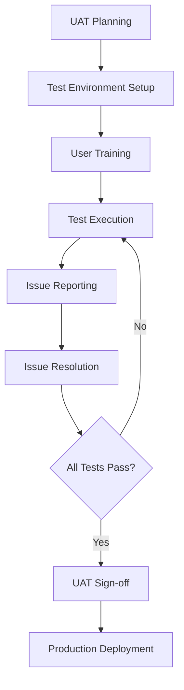

# 4. User Acceptance Testing

## 👥 **User Acceptance Testing Overview**

This document outlines the comprehensive User Acceptance Testing (UAT) strategy for the ZbInnovation platform, including UAT planning, test scenarios, stakeholder involvement, and acceptance criteria validation.

## 🎯 **UAT Strategy and Planning**

### **UAT Objectives**
- Validate business requirements fulfillment
- Ensure user experience meets expectations
- Verify platform readiness for production deployment
- Confirm all user journeys work end-to-end
- Validate performance under realistic usage scenarios

### **UAT Phases**
```
Phase 1: Alpha Testing (Internal)
├── Development team testing
├── Internal stakeholder review
└── Initial bug fixes

Phase 2: Beta Testing (Limited External)
├── Selected user group testing
├── Feedback collection and analysis
└── Priority issue resolution

Phase 3: Production Readiness Testing
├── Full feature validation
├── Performance acceptance
└── Final sign-off
```

## 📋 **UAT Test Scenarios**

### **User Registration and Onboarding**
```gherkin
Feature: User Registration and Profile Setup
  As a new user
  I want to register and set up my profile
  So that I can access the platform features

Scenario: Successful Innovator Registration
  Given I am on the registration page
  When I fill in valid registration details:
    | Field        | Value                    |
    | First Name   | John                     |
    | Last Name    | Innovator               |
    | Email        | john@startup.com        |
    | Password     | SecurePass123!          |
    | Profile Type | Innovator               |
  And I agree to terms and conditions
  And I click "Register"
  Then I should be redirected to the dashboard
  And I should see a welcome message
  And I should receive a welcome email

Scenario: Profile Completion Flow
  Given I am logged in as a new innovator
  When I click "Complete Profile"
  Then I should see innovator-specific fields:
    | Field              | Required |
    | Startup Name       | No       |
    | Industry Focus     | Yes      |
    | Innovation Stage   | Yes      |
    | Funding Needed     | No       |
    | Bio                | No       |
  When I fill in required fields
  And I click "Save Profile"
  Then my profile completion should increase
  And I should see updated completion percentage

Scenario: Email Verification
  Given I have registered but not verified my email
  When I check my email inbox
  Then I should receive a verification email
  When I click the verification link
  Then my email should be marked as verified
  And I should be able to access all platform features
```

### **Community Interaction Testing**
```gherkin
Feature: Community Feed and Interaction
  As a verified user
  I want to interact with the community
  So that I can network and share knowledge

Scenario: Creating and Publishing a Post
  Given I am logged in and on the community page
  When I click "Create Post"
  And I enter post details:
    | Field    | Value                                    |
    | Title    | Seeking Co-founder for AI Startup      |
    | Content  | Looking for a technical co-founder...   |
    | Category | Opportunities                           |
  And I click "Publish"
  Then the post should appear in the community feed
  And other users should be able to see the post
  And I should receive notifications for interactions

Scenario: Engaging with Posts
  Given I am viewing the community feed
  When I see a post that interests me
  And I click the "Like" button
  Then the like count should increase
  And the post author should receive a notification
  When I click "Comment"
  And I write a meaningful comment
  And I click "Submit Comment"
  Then my comment should appear under the post
  And the post author should receive a comment notification

Scenario: Profile Discovery and Connection
  Given I am on the Profiles tab
  When I search for "technology innovators"
  Then I should see relevant profiles
  When I click on a profile
  Then I should see their full profile information
  When I click "Connect"
  Then a connection request should be sent
  And the recipient should receive a notification
  When the recipient accepts the connection
  Then we should be connected
  And both users should see the connection in their network
```

### **Profile Type-Specific Testing**

#### **Innovator Journey Testing**
```gherkin
Feature: Innovator-Specific Features
  As an innovator
  I want to access features relevant to my needs
  So that I can grow my startup

Scenario: Funding Opportunity Discovery
  Given I am logged in as an innovator
  And I have completed my profile with funding needs
  When I navigate to the dashboard
  Then I should see recommended funding opportunities
  When I click on a funding opportunity
  Then I should see detailed information
  And I should be able to apply or express interest

Scenario: Mentor Matching
  Given I am an innovator seeking mentorship
  When I specify my mentorship needs
  Then I should see recommended mentors
  When I request mentorship from a mentor
  And the mentor accepts
  Then we should be connected as mentor-mentee
```

#### **Investor Journey Testing**
```gherkin
Feature: Investor-Specific Features
  As a business investor
  I want to discover investment opportunities
  So that I can make informed investment decisions

Scenario: Investment Opportunity Discovery
  Given I am logged in as an investor
  And I have set my investment preferences
  When I navigate to the dashboard
  Then I should see startups matching my criteria
  When I filter by industry and stage
  Then the results should update accordingly
  When I click on a startup profile
  Then I should see detailed business information
  And I should be able to express investment interest

Scenario: Due Diligence Process
  Given I am interested in a startup
  When I request additional information
  Then the startup should receive my request
  When they share their pitch deck
  Then I should be able to review it
  And I should be able to schedule a meeting
```

## 🔍 **Acceptance Criteria Validation**

### **Functional Acceptance Criteria**
```yaml
authentication:
  - Users can register with valid email and password
  - Email verification works correctly
  - Password reset functionality works
  - Users can login and logout successfully
  - Session management works properly

profile_management:
  - All profile types can be created and updated
  - Profile completion calculation is accurate
  - Profile visibility settings work correctly
  - Profile photos can be uploaded and displayed
  - Profile search and filtering work properly

community_features:
  - Posts can be created, edited, and deleted
  - Like and comment functionality works
  - Feed filtering and sorting work correctly
  - Real-time notifications are delivered
  - Connection requests can be sent and managed

dashboard:
  - Personalized content is displayed correctly
  - Analytics and metrics are accurate
  - Recommendations are relevant
  - Quick actions work properly
  - Mobile responsiveness is maintained
```

### **Performance Acceptance Criteria**
```yaml
response_times:
  - Page load time < 3 seconds
  - API response time < 500ms (95th percentile)
  - Search results appear < 2 seconds
  - File upload completes < 30 seconds

scalability:
  - Platform supports 1000 concurrent users
  - Database queries perform well under load
  - Real-time features work with multiple users
  - System remains stable during peak usage

usability:
  - Navigation is intuitive and consistent
  - Forms are easy to complete
  - Error messages are clear and helpful
  - Mobile experience is optimized
  - Accessibility standards are met
```

## 👥 **Stakeholder Involvement**

### **UAT Team Structure**
```
UAT Manager
├── Business Stakeholders
│   ├── Product Owner
│   ├── Business Analysts
│   └── Domain Experts
├── End User Representatives
│   ├── Innovators (3-5 users)
│   ├── Investors (2-3 users)
│   ├── Mentors (2-3 users)
│   └── Other Profile Types (1-2 each)
└── Technical Team
    ├── QA Lead
    ├── Development Lead
    └── DevOps Engineer
```

### **UAT Execution Process**


## 📊 **UAT Test Management**

### **Test Case Template**
```markdown
# UAT Test Case: [TC-001]

## Test Case Details
- **Test Case ID**: TC-001
- **Test Case Name**: User Registration Flow
- **Priority**: High
- **Test Type**: Functional
- **Estimated Time**: 15 minutes

## Prerequisites
- Access to UAT environment
- Valid email address for testing
- Browser: Chrome/Firefox/Safari

## Test Steps
1. Navigate to registration page
2. Fill in registration form with valid data
3. Submit registration
4. Check email for verification
5. Click verification link
6. Login with new credentials

## Expected Results
- Registration completes successfully
- Verification email is received
- Email verification works
- User can login after verification

## Actual Results
[To be filled during execution]

## Status
- [ ] Pass
- [ ] Fail
- [ ] Blocked

## Comments
[Any additional observations]

## Tested By
[Tester Name and Date]
```

### **UAT Defect Template**
```markdown
# UAT Defect: [DEF-001]

## Defect Details
- **Defect ID**: DEF-001
- **Summary**: Profile completion percentage not updating
- **Severity**: Medium
- **Priority**: High
- **Status**: Open
- **Environment**: UAT
- **Browser**: Chrome 120.0

## Description
When updating profile information, the completion percentage
does not reflect the changes immediately.

## Steps to Reproduce
1. Login as new user
2. Navigate to profile page
3. Fill in bio field
4. Save profile
5. Check completion percentage

## Expected Result
Completion percentage should increase after saving profile

## Actual Result
Completion percentage remains unchanged

## Screenshots
[Attach relevant screenshots]

## Reported By
[Reporter Name and Date]

## Assigned To
[Developer Name]

## Resolution
[To be filled when resolved]
```

## 📈 **UAT Metrics and Reporting**

### **UAT Dashboard Metrics**
```typescript
interface UATMetrics {
  testExecution: {
    totalTestCases: number;
    executed: number;
    passed: number;
    failed: number;
    blocked: number;
    passRate: number;
  };
  
  defectMetrics: {
    totalDefects: number;
    open: number;
    resolved: number;
    closed: number;
    critical: number;
    high: number;
    medium: number;
    low: number;
  };
  
  userFeedback: {
    overallSatisfaction: number; // 1-10 scale
    easeOfUse: number;
    performance: number;
    features: number;
    recommendations: string[];
  };
  
  timeline: {
    startDate: Date;
    plannedEndDate: Date;
    actualEndDate?: Date;
    milestonesCompleted: number;
    totalMilestones: number;
  };
}
```

### **UAT Sign-off Criteria**
```yaml
sign_off_criteria:
  test_execution:
    - 100% of critical test cases executed
    - 95% of high priority test cases passed
    - 90% of medium priority test cases passed
    - All critical defects resolved
    - No high priority defects remaining

  performance:
    - All performance benchmarks met
    - Load testing completed successfully
    - No performance regressions identified

  user_satisfaction:
    - Average satisfaction score > 7/10
    - No major usability issues reported
    - Accessibility requirements met

  business_requirements:
    - All must-have features working
    - Business processes validated
    - Compliance requirements met
```

---

## 📚 **Reference Documents**

**System Integration**: See `/6_integration_and_testing/1_system_integration.md`
**End-to-End Testing**: See `/6_integration_and_testing/2_end_to_end_testing.md`
**User Requirements**: See `/1_planning_and_requirements/2_user_requirements_and_journeys.md`
**Business Requirements**: See `/1_planning_and_requirements/4_business_requirements.md`

*This comprehensive UAT strategy ensures the ZbInnovation platform meets all business requirements and user expectations before production deployment.*
