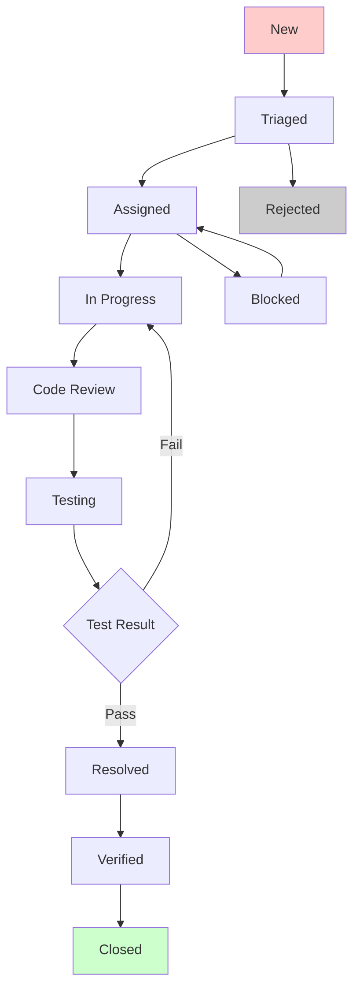

# 5. Bug Tracking and Resolution

## 🐛 **Bug Tracking Overview**

This document outlines the comprehensive bug tracking and resolution process for the ZbInnovation platform, including bug classification, tracking workflows, resolution procedures, and quality assurance protocols.

## 🏗️ **Bug Classification System**

### **Severity Levels**
```yaml
severity_levels:
  critical:
    description: "System crashes, data loss, security vulnerabilities"
    response_time: "1 hour"
    resolution_time: "4 hours"
    examples:
      - "Application crashes on login"
      - "User data being corrupted"
      - "Security breach allowing unauthorized access"
  
  high:
    description: "Major functionality broken, significant user impact"
    response_time: "4 hours"
    resolution_time: "24 hours"
    examples:
      - "Unable to create posts"
      - "Payment processing fails"
      - "Email notifications not working"
  
  medium:
    description: "Minor functionality issues, workaround available"
    response_time: "24 hours"
    resolution_time: "72 hours"
    examples:
      - "Profile photo upload occasionally fails"
      - "Search results sometimes incomplete"
      - "UI elements misaligned on specific browsers"
  
  low:
    description: "Cosmetic issues, minor inconveniences"
    response_time: "72 hours"
    resolution_time: "1 week"
    examples:
      - "Text formatting inconsistencies"
      - "Minor UI improvements"
      - "Non-critical feature enhancements"
```

### **Priority Matrix**
```
High Impact    │ Critical/High  │ High/Medium   │
Medium Impact  │ High/Medium    │ Medium/Low    │
Low Impact     │ Medium/Low     │ Low/Low       │
               └─────────────────────────────────
                High Frequency  Medium Freq.  Low Freq.
```

## 🔄 **Bug Tracking Workflow**

### **Bug Lifecycle States**


### **Bug Report Template**
```markdown
# Bug Report: [BUG-YYYY-NNNN]

## Bug Information
- **Bug ID**: BUG-2024-0001
- **Title**: Profile completion percentage not updating correctly
- **Reporter**: John Doe (john.doe@example.com)
- **Date Reported**: 2024-01-15 14:30:00
- **Environment**: Production / Staging / Development
- **Browser/Device**: Chrome 120.0 / Windows 11
- **User Role**: Innovator

## Classification
- **Severity**: Medium
- **Priority**: High
- **Component**: Profile Management
- **Module**: User Dashboard
- **Tags**: profile, completion, calculation

## Description
When a user updates their profile information, the completion 
percentage displayed on the dashboard does not reflect the 
changes immediately. The percentage only updates after a 
page refresh or re-login.

## Steps to Reproduce
1. Login as a user with incomplete profile
2. Navigate to profile edit page
3. Fill in missing required fields (e.g., bio, industry)
4. Save the profile
5. Return to dashboard
6. Observe completion percentage

## Expected Behavior
The profile completion percentage should update immediately 
after saving profile changes, reflecting the new completion status.

## Actual Behavior
The completion percentage remains unchanged until page refresh 
or re-login, showing stale data.

## Screenshots/Videos
[Attach relevant media files]

## Additional Information
- Occurs consistently across all browsers
- Issue affects all user types
- Backend API returns correct completion percentage
- Frontend state not updating properly

## Workaround
Refresh the page or logout/login to see updated percentage.

## Related Issues
- BUG-2024-0002 (Profile cache not invalidating)
- FEATURE-2024-0015 (Real-time profile updates)
```

## 🔧 **Bug Resolution Process**

### **Triage Process**
```typescript
interface BugTriageProcess {
  step1_initial_review: {
    reviewer: "QA Lead";
    actions: [
      "Verify bug reproducibility",
      "Check for duplicates",
      "Validate bug report completeness",
      "Assign initial severity/priority"
    ];
    outcome: "Accept" | "Reject" | "Need More Info";
  };
  
  step2_technical_analysis: {
    reviewer: "Technical Lead";
    actions: [
      "Analyze technical complexity",
      "Estimate effort required",
      "Identify affected components",
      "Determine root cause category"
    ];
    outcome: "Assign to developer" | "Escalate" | "Defer";
  };
  
  step3_assignment: {
    reviewer: "Project Manager";
    actions: [
      "Assign to appropriate developer",
      "Set target resolution date",
      "Update stakeholders",
      "Add to sprint if urgent"
    ];
  };
}
```

### **Resolution Workflow**
```java
// Backend: BugTrackingService.java
@Service
@Slf4j
public class BugTrackingService {
    
    @Autowired
    private BugRepository bugRepository;
    
    @Autowired
    private NotificationService notificationService;
    
    @Autowired
    private AuditService auditService;
    
    public Bug createBug(CreateBugRequest request) {
        Bug bug = Bug.builder()
            .title(request.getTitle())
            .description(request.getDescription())
            .severity(request.getSeverity())
            .priority(calculatePriority(request))
            .status(BugStatus.NEW)
            .reportedBy(request.getReporterId())
            .reportedAt(LocalDateTime.now())
            .environment(request.getEnvironment())
            .component(request.getComponent())
            .build();
        
        Bug savedBug = bugRepository.save(bug);
        
        // Notify relevant stakeholders
        notifyStakeholders(savedBug);
        
        // Log audit trail
        auditService.logBugCreation(savedBug);
        
        log.info("Bug created: {}", savedBug.getId());
        return savedBug;
    }
    
    @Transactional
    public Bug updateBugStatus(String bugId, BugStatus newStatus, String comment) {
        Bug bug = bugRepository.findById(bugId)
            .orElseThrow(() -> new BugNotFoundException("Bug not found: " + bugId));
        
        BugStatus oldStatus = bug.getStatus();
        bug.setStatus(newStatus);
        bug.setLastUpdated(LocalDateTime.now());
        
        // Add status change comment
        BugComment statusComment = BugComment.builder()
            .bug(bug)
            .comment(comment)
            .commentType(CommentType.STATUS_CHANGE)
            .createdBy(getCurrentUserId())
            .createdAt(LocalDateTime.now())
            .build();
        
        bug.getComments().add(statusComment);
        
        Bug updatedBug = bugRepository.save(bug);
        
        // Handle status-specific actions
        handleStatusChange(updatedBug, oldStatus, newStatus);
        
        return updatedBug;
    }
    
    private void handleStatusChange(Bug bug, BugStatus oldStatus, BugStatus newStatus) {
        switch (newStatus) {
            case ASSIGNED:
                notificationService.notifyDeveloper(bug.getAssignedTo(), bug);
                break;
            case RESOLVED:
                notificationService.notifyTester(bug.getReportedBy(), bug);
                scheduleVerificationReminder(bug);
                break;
            case VERIFIED:
                notificationService.notifyReporter(bug.getReportedBy(), bug);
                break;
            case CLOSED:
                updateMetrics(bug);
                break;
        }
        
        auditService.logStatusChange(bug, oldStatus, newStatus);
    }
    
    private Priority calculatePriority(CreateBugRequest request) {
        // Priority calculation based on severity and business impact
        Severity severity = request.getSeverity();
        BusinessImpact impact = request.getBusinessImpact();
        
        if (severity == Severity.CRITICAL) {
            return Priority.CRITICAL;
        }
        
        if (severity == Severity.HIGH && impact == BusinessImpact.HIGH) {
            return Priority.HIGH;
        }
        
        if (severity == Severity.HIGH || impact == BusinessImpact.HIGH) {
            return Priority.MEDIUM;
        }
        
        return Priority.LOW;
    }
}
```

## 📊 **Bug Metrics and Analytics**

### **Bug Tracking Dashboard**
```typescript
// Frontend: BugDashboard.tsx
interface BugMetrics {
  totalBugs: number;
  openBugs: number;
  resolvedBugs: number;
  closedBugs: number;
  averageResolutionTime: number;
  bugsByComponent: ComponentBugCount[];
  bugsBySeverity: SeverityBugCount[];
  trendData: BugTrendData[];
}

export const BugDashboard: React.FC = () => {
  const { data: metrics, isLoading } = useQuery({
    queryKey: ['bug-metrics'],
    queryFn: () => apiClient.get<BugMetrics>('/bugs/metrics'),
    refetchInterval: 5 * 60 * 1000, // Refresh every 5 minutes
  });

  if (isLoading) return <LoadingSpinner />;

  return (
    <Grid container spacing={3}>
      {/* Summary Cards */}
      <Grid item xs={12} md={3}>
        <MetricCard
          title="Total Bugs"
          value={metrics.totalBugs}
          icon={<BugReportIcon />}
          color="primary"
        />
      </Grid>
      
      <Grid item xs={12} md={3}>
        <MetricCard
          title="Open Bugs"
          value={metrics.openBugs}
          icon={<ErrorIcon />}
          color="error"
        />
      </Grid>
      
      <Grid item xs={12} md={3}>
        <MetricCard
          title="Resolved This Week"
          value={metrics.resolvedBugs}
          icon={<CheckCircleIcon />}
          color="success"
        />
      </Grid>
      
      <Grid item xs={12} md={3}>
        <MetricCard
          title="Avg Resolution Time"
          value={`${metrics.averageResolutionTime}h`}
          icon={<TimerIcon />}
          color="info"
        />
      </Grid>

      {/* Charts */}
      <Grid item xs={12} md={6}>
        <Card>
          <CardHeader title="Bugs by Component" />
          <CardContent>
            <PieChart data={metrics.bugsByComponent} />
          </CardContent>
        </Card>
      </Grid>
      
      <Grid item xs={12} md={6}>
        <Card>
          <CardHeader title="Bug Trend" />
          <CardContent>
            <LineChart data={metrics.trendData} />
          </CardContent>
        </Card>
      </Grid>

      {/* Recent Bugs Table */}
      <Grid item xs={12}>
        <BugTable />
      </Grid>
    </Grid>
  );
};
```

### **Quality Metrics**
```java
// Backend: QualityMetricsService.java
@Service
public class QualityMetricsService {
    
    public QualityReport generateQualityReport(LocalDate startDate, LocalDate endDate) {
        List<Bug> bugs = bugRepository.findByDateRange(startDate, endDate);
        
        return QualityReport.builder()
            .reportPeriod(new DateRange(startDate, endDate))
            .totalBugs(bugs.size())
            .bugsByComponent(calculateBugsByComponent(bugs))
            .bugsBySeverity(calculateBugsBySeverity(bugs))
            .averageResolutionTime(calculateAverageResolutionTime(bugs))
            .reopenRate(calculateReopenRate(bugs))
            .escapeRate(calculateEscapeRate(bugs))
            .qualityScore(calculateQualityScore(bugs))
            .trends(calculateTrends(bugs))
            .build();
    }
    
    private double calculateQualityScore(List<Bug> bugs) {
        if (bugs.isEmpty()) return 100.0;
        
        long criticalBugs = bugs.stream()
            .filter(bug -> bug.getSeverity() == Severity.CRITICAL)
            .count();
        
        long highBugs = bugs.stream()
            .filter(bug -> bug.getSeverity() == Severity.HIGH)
            .count();
        
        double escapeRate = calculateEscapeRate(bugs);
        double reopenRate = calculateReopenRate(bugs);
        
        // Quality score calculation (0-100)
        double score = 100.0;
        score -= (criticalBugs * 10); // -10 points per critical bug
        score -= (highBugs * 5);      // -5 points per high bug
        score -= (escapeRate * 20);   // -20 points per % escape rate
        score -= (reopenRate * 15);   // -15 points per % reopen rate
        
        return Math.max(0, score);
    }
    
    private double calculateEscapeRate(List<Bug> bugs) {
        long productionBugs = bugs.stream()
            .filter(bug -> bug.getEnvironment() == Environment.PRODUCTION)
            .count();
        
        return bugs.isEmpty() ? 0.0 : (double) productionBugs / bugs.size() * 100;
    }
    
    private double calculateReopenRate(List<Bug> bugs) {
        long reopenedBugs = bugs.stream()
            .filter(bug -> bug.getReopenCount() > 0)
            .count();
        
        return bugs.isEmpty() ? 0.0 : (double) reopenedBugs / bugs.size() * 100;
    }
}
```

## 🚨 **Automated Bug Detection**

### **Error Monitoring Integration**
```typescript
// Frontend: ErrorBoundary with automatic bug reporting
export class ErrorBoundary extends React.Component<
  { children: React.ReactNode },
  { hasError: boolean; error?: Error }
> {
  constructor(props: any) {
    super(props);
    this.state = { hasError: false };
  }

  static getDerivedStateFromError(error: Error) {
    return { hasError: true, error };
  }

  componentDidCatch(error: Error, errorInfo: React.ErrorInfo) {
    // Automatically report critical frontend errors
    this.reportError(error, errorInfo);
  }

  private async reportError(error: Error, errorInfo: React.ErrorInfo) {
    try {
      await apiClient.post('/bugs/auto-report', {
        title: `Frontend Error: ${error.name}`,
        description: `
          Error: ${error.message}
          Stack: ${error.stack}
          Component Stack: ${errorInfo.componentStack}
        `,
        severity: 'HIGH',
        component: 'Frontend',
        environment: process.env.NODE_ENV,
        autoReported: true,
        userAgent: navigator.userAgent,
        url: window.location.href,
        timestamp: new Date().toISOString(),
      });
    } catch (reportError) {
      console.error('Failed to auto-report error:', reportError);
    }
  }

  render() {
    if (this.state.hasError) {
      return (
        <Box p={3} textAlign="center">
          <Typography variant="h5" color="error" gutterBottom>
            Something went wrong
          </Typography>
          <Typography variant="body1" color="text.secondary" paragraph>
            We've been notified about this error and will fix it soon.
          </Typography>
          <Button
            variant="contained"
            onClick={() => window.location.reload()}
          >
            Reload Page
          </Button>
        </Box>
      );
    }

    return this.props.children;
  }
}
```

### **Performance Issue Detection**
```java
// Backend: Performance monitoring with automatic issue creation
@Component
@Slf4j
public class PerformanceMonitor {
    
    @Autowired
    private BugTrackingService bugTrackingService;
    
    @EventListener
    public void handleSlowRequest(SlowRequestEvent event) {
        if (event.getDuration() > 5000) { // 5 seconds threshold
            CreateBugRequest bugRequest = CreateBugRequest.builder()
                .title("Performance Issue: Slow API Response")
                .description(String.format(
                    "API endpoint %s took %dms to respond, exceeding threshold of 5000ms",
                    event.getEndpoint(), event.getDuration()
                ))
                .severity(Severity.MEDIUM)
                .component("Performance")
                .environment(Environment.PRODUCTION)
                .autoReported(true)
                .metadata(Map.of(
                    "endpoint", event.getEndpoint(),
                    "duration", event.getDuration(),
                    "timestamp", event.getTimestamp()
                ))
                .build();
            
            bugTrackingService.createBug(bugRequest);
        }
    }
    
    @Scheduled(fixedRate = 300000) // Every 5 minutes
    public void checkSystemHealth() {
        SystemHealthMetrics metrics = healthService.getMetrics();
        
        if (metrics.getCpuUsage() > 90) {
            reportPerformanceIssue("High CPU Usage", 
                "CPU usage is " + metrics.getCpuUsage() + "%");
        }
        
        if (metrics.getMemoryUsage() > 90) {
            reportPerformanceIssue("High Memory Usage", 
                "Memory usage is " + metrics.getMemoryUsage() + "%");
        }
        
        if (metrics.getErrorRate() > 5) {
            reportPerformanceIssue("High Error Rate", 
                "Error rate is " + metrics.getErrorRate() + "%");
        }
    }
}
```

---

## 📚 **Reference Documents**

**System Integration**: See `/6_integration_and_testing/1_system_integration.md`
**User Acceptance Testing**: See `/6_integration_and_testing/4_user_acceptance_testing.md`
**Quality Assurance**: See `/3_development_setup/2_coding_standards_and_guidelines.md`
**Monitoring**: See `/7_deployment_and_operations/2_monitoring_and_logging.md`

*This comprehensive bug tracking and resolution system ensures high-quality software delivery and continuous improvement for the ZbInnovation platform.*
